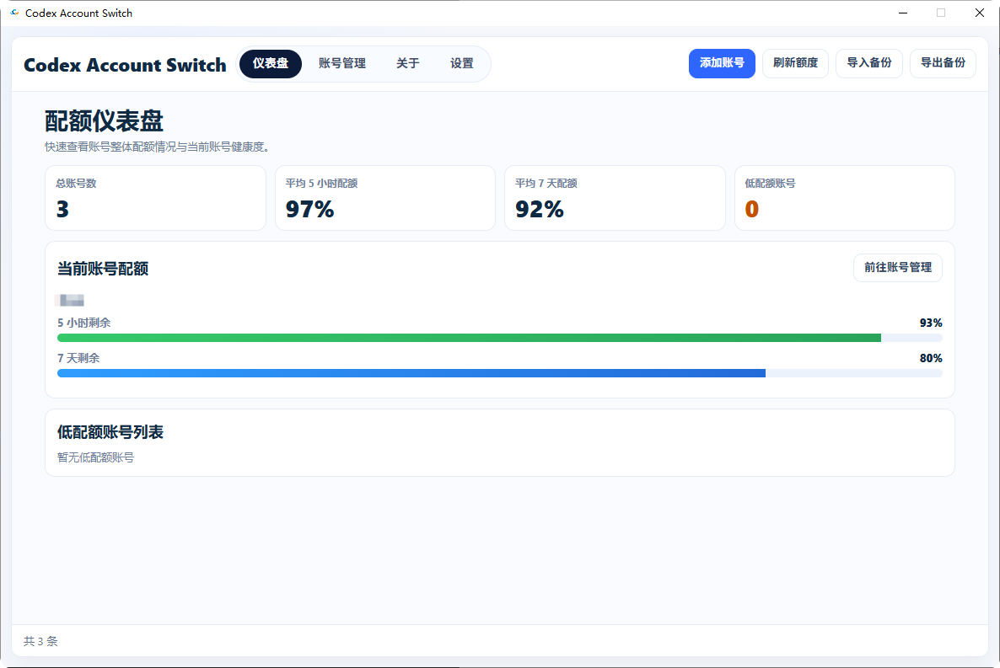
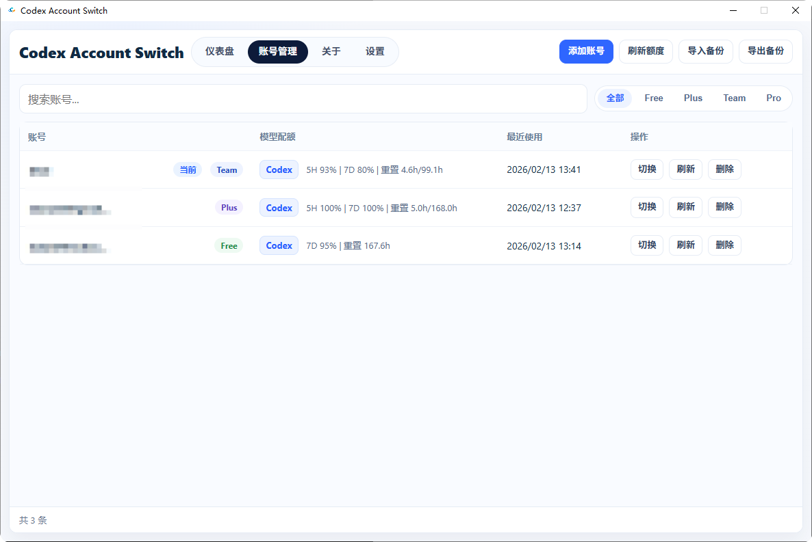
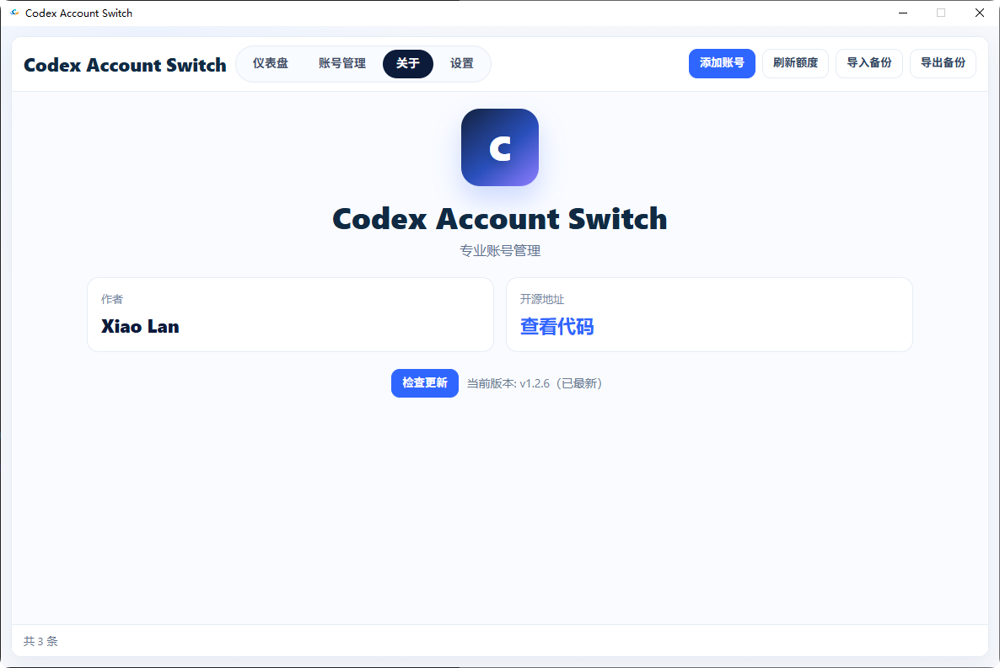
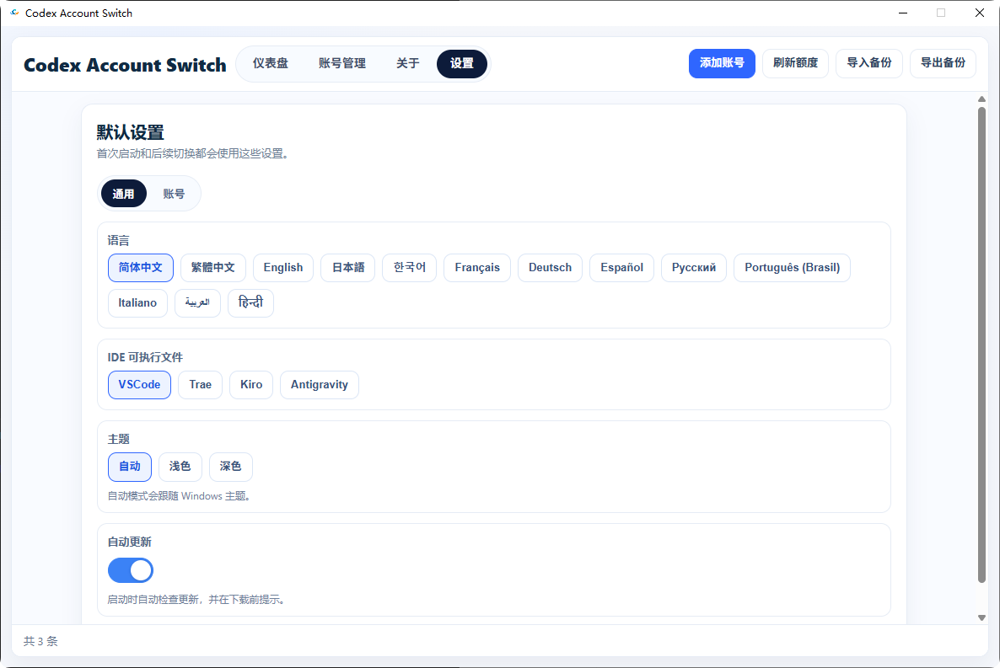
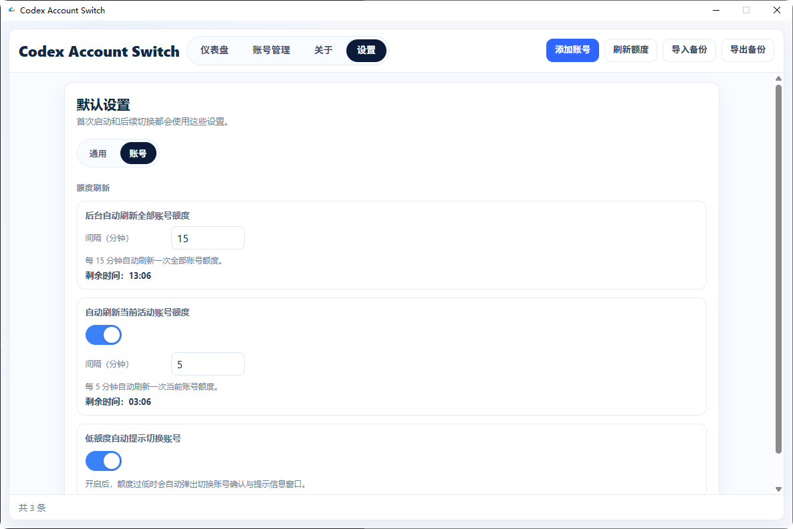

<h1 align="center"><b>Codex Account Switch</b></h1>

  <b>本地化、多账号、高效率的 Codex 账号管理与切换工具</b> 
  基于 <code>C++ / Win32 / WebView2</code>，专注稳定与速度。

  <a href="./README_EN.md"><b>English README</b></a>

## 核心功能

- 账号备份/切换/删除，一站式管理
- 支持导入/导出账号备份包（ZIP）
- 支持快速导入已有 OAuth 授权文件
- 支持额度自动刷新（5H / 7D 额度与重置信息）
- 支持账号套餐自动识别 Free/Plus/Team/Pro
- 支持主题模式：自动 / 浅色 / 深色
- 支持多语言 UI（`webui/lang/*.json`）

## 界面预览

### 1. 仪表盘

  

### 2.1 账号管理-添加账号

  

### 2. 账号管理

  

### 3. 关于

  

### 4. 设置-通用

  

### 5. 设置-账号

  

## 技术架构

- 原生层：`C++ / Win32 / WebView2`
- 前端层：`HTML + CSS + JavaScript`
- 通信方式：WebView `postMessage` 与 Host Action 路由
- 数据存储：本地 JSON 文件（用户目录）

主要目录：

- `Codex_AccountSwitch/`：核心 C++ 源码
- `webui/`：前端界面资源
- `installer/`：安装包脚本
- `image/`：README 演示图片

## 数据目录

运行时数据默认写入：

- `%LOCALAPPDATA%\Codex Account Switch\config.json`
- `%LOCALAPPDATA%\Codex Account Switch\backups\index.json`
- `%LOCALAPPDATA%\Codex Account Switch\backups\...`

## 安装指南

### 运行环境

- Windows 10/11 x64
- WebView2 Runtime

### 编译

1. 打开解决方案：`Codex_AccountSwitch.slnx`
2. 选择 `Release | x64`
3. 编译后产物：
   - `x64/Release/Codex_AccountSwitch.exe`
   - `x64/Release/WebView2Loader.dll`

### 打包安装程序

- `installer/build_installer.bat`（推荐）
- `installer/build_installer.ps1`

输出目录：`dist/`

## 感谢

- 感谢 `Microsoft Edge WebView2` 团队提供稳定高性能的嵌入式 Web 运行时支持。
- 感谢所有参与测试、反馈问题和提出建议的用户与开发者。

## 贡献者

- [isxlan0](https://github.com/isxlan0)

## 许可证

本项目采用 `MIT License`，详见 `LICENSE`。

## 安全说明

所有账号数据默认仅保存在本地。除非你主动导出或分享，否则数据不会离开设备。
