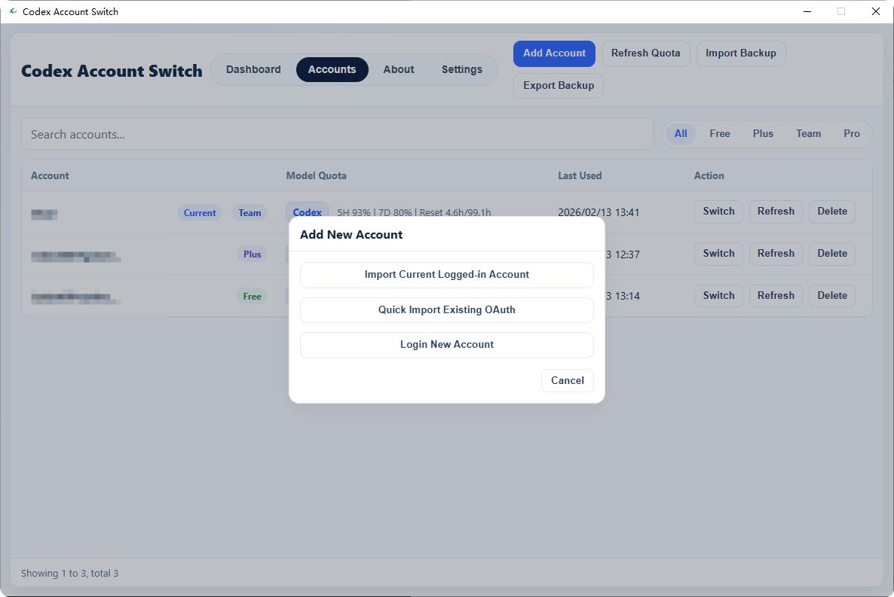
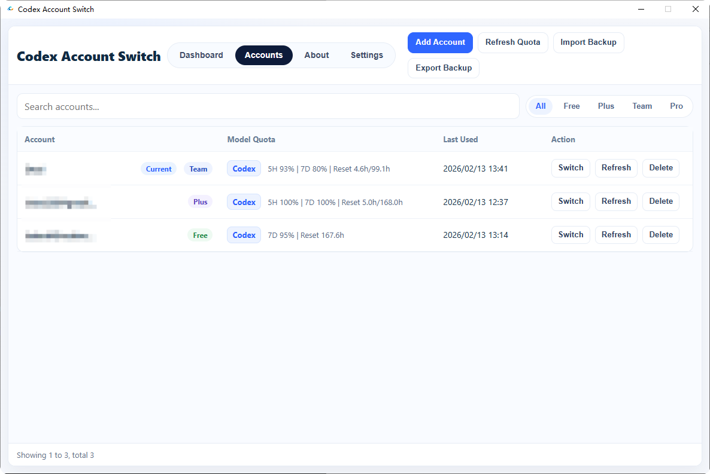
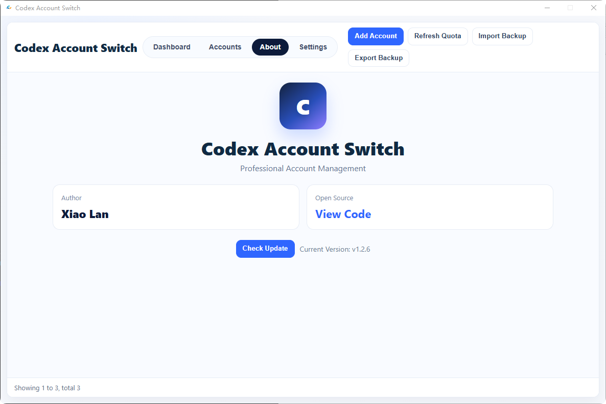
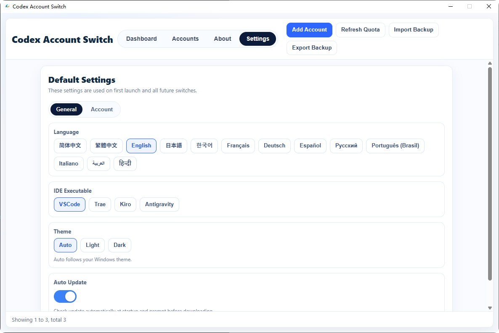
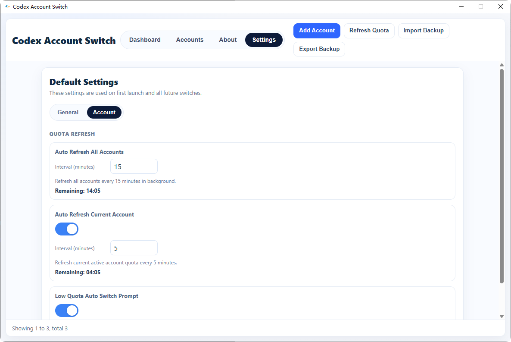

<h1 align="center"><b>Codex Account Switch</b></h1>

  <b>A fast, local-first multi-account manager for Codex</b> 
  Built with <code>C++ / Win32 / WebView2</code> for performance and reliability.

  <a href="./README.md"><b>简体中文 README</b></a>

## Core Features

- One-stop account backup / switch / delete workflow
- Import / export backup bundles (ZIP)
- Fast import for existing OAuth auth files
- Quota refresh support (5H / 7D windows and reset info)
- Automatic account plan detection (Free / Plus / Team / Pro)
- Theme modes: Auto / Light / Dark
- Multi-language UI via `webui/lang/*.json`

## UI Preview

### 1. Dashboard

  

### 2.1 Account Management - Add Account

  

### 2. Account Management

  

### 3. About

  

### 4. Settings - General

  

### 5. Settings - Account

  

## Technical Architecture

- Native layer: `C++ / Win32 / WebView2`
- Frontend layer: `HTML + CSS + JavaScript`
- Bridge: WebView `postMessage` + host action routing
- Storage: local JSON files in user profile data path

Main folders:

- `Codex_AccountSwitch/`: core C++ source
- `webui/`: frontend assets
- `installer/`: setup build scripts
- `image/`: README screenshots

## Data Directory

Runtime data is stored in:

- `%LOCALAPPDATA%\Codex Account Switch\config.json`
- `%LOCALAPPDATA%\Codex Account Switch\backups\index.json`
- `%LOCALAPPDATA%\Codex Account Switch\backups\...`

## Installation Guide

### Requirements

- Windows 10/11 x64
- WebView2 Runtime

### Build

1. Open solution: `Codex_AccountSwitch.slnx`
2. Choose `Release | x64`
3. Build outputs:
   - `x64/Release/Codex_AccountSwitch.exe`
   - `x64/Release/WebView2Loader.dll`

### Build Installer

- `installer/build_installer.bat` (recommended)
- `installer/build_installer.ps1`

Output folder: `dist/`

## Thanks

- Thanks to the `Microsoft Edge WebView2` team for the stable, high-performance embedded web runtime.
- Thanks to all users and contributors who reported issues and shared feedback.

## Contributors

- [isxlan0](https://github.com/isxlan0)

## License

Licensed under the `MIT License`. See `LICENSE`.

## Security Notice

All account data is stored locally by default. Data never leaves your device unless you explicitly export/share it.
